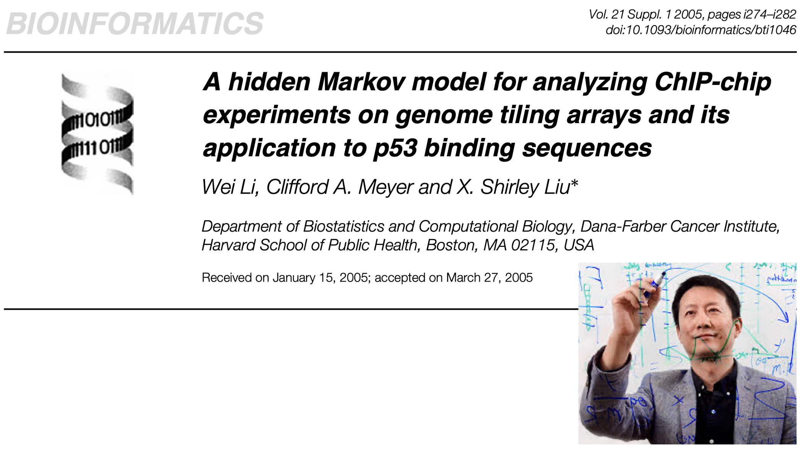

```{r setup, include=FALSE}
knitr::opts_chunk$set(echo = FALSE)
```

## Introduction


## Introduction


## Introduction


## GitHub Repository
Please note the following GitHub Repository for all materials for this tutorial:

https://github.com/wevanjohnson/2024_07_hmm_tutorial

## Examples using Hidden Markov Models


## Examples using Hidden Markov Models


## Examples using Hidden Markov Models


## Introduction to Dynamic Programming
Before we study **Hidden Markov Models (HMMs)** it is necessary to begin with an introduction to **dynamic programming (DP)**.


## Introduction to Dynamic Programming
An instructive example for the use of DP deals with finding the
optimal alignment between two DNA strands. 

\vspace{0.25in}
Consider two DNA sequences, $x=\{\textrm{C A G A T G A G C A}\}$ and $y=\{\textrm{T C A A T G A A C A}\}$, we note how many times $x_i=y_i$, where $x_i$ is the $i$th element of $x$. 

## Ungapped Alignment
We observe the **ungapped alignment**, which has 6 matches and 4 mismatches:
\center 
\begin{tabular}{cccccccccc}
  C & A & G & A & T & G & A & G & C & A \\
   &  &  & $\mid$ & $\mid$ & $\mid$ & $\mid$ &  & $\mid$ & $\mid$ \\
  T & C & A & A & T & G & A & A & C & A \\
\end{tabular}

## Gapped Alignment
For a **gapped alignment**, denoted by '$-$' for the gaps, to be inserted into the sequences then we can create more matches, in this case 8 matches: 

\center
\begin{tabular}{ccccccccccc}
$-$ & C & A & G & A & T & G & A & G & C & A \\
  & $\mid$ & $\mid$ & & $\mid$ & $\mid$ & $\mid$ & $\mid$ & & $\mid$ & $\mid$ \\
T & C & A & $-$ & A & T & G & A & A & C & A \\
\end{tabular}

## Gapped Alignment
We will denote the set of all gapped sequences of a sequence $x$ by **$\mathcal{A}_x$**, and thus $x\in\mathcal{A}_x$.

## Scoring matches, mismatches, gaps
Suppose we are interested in finding the optimal gapped alignment of two sequences $x$ and $y$ using the scoring function $S$ given by

\[
S(x_i,y_i)=\left\{
\begin{array}{ll}
1 & \mbox{ if } x_i=y_i \\
-1 & \mbox{ if } x_i\neq y_i \\
-2 & \mbox{ if } x_i=- \mbox{ or } y_i=-
\end{array}
\right.
\]

## Scoring matches, mismatches, gaps
Then the optimal alignment is given by solving
\begin{eqnarray}\label{system}
\max_{(\hat{x},\hat{y})\in\mathcal{A}_x\times\mathcal{A}_y} &&
\left\{\sum_i^{len(\hat{x})}S(\hat{x}_i,\hat{y}_i)\right\}\nonumber
\\
\textrm{s.t.} &&  len(\hat{x})=len(\hat{y}) \nonumber
\end{eqnarray}
where $len(x)$ denotes the number of elements in $x$.  

\vspace{0.1in}
Note: that we do not require $len(x)=len(y)$ but only $len(\hat{x})=len(\hat{y})$.  

## Scoring matches, mismatches, gaps
This alignment (shown previously) is the solution to the system given by (\ref{system}) with a score of 3: 

\center
\begin{tabular}{ccccccccccc}
$-$ & C & A & G & A & T & G & A & G & C & A \\
  & $\mid$ & $\mid$ & & $\mid$ & $\mid$ & $\mid$ & $\mid$ & & $\mid$ & $\mid$ \\
T & C & A & $-$ & A & T & G & A & A & C & A \\
\end{tabular}

## Finding the optimal alignment

One way to solve this system for any given $x$ and $y$ is to check
the score of all possible gapped alignments by considering every
$\hat{x}$ and $\hat{y}$ with the same length.  

\vspace{0.2in}
This method is obviously computationally inefficient. Dynamic programming allows us to eliminate suboptimal alignments by breaking solving subproblems of the original problem.


## Needleman-Wunsch Algorithm

Given two sequences $x$ and $y$ let $len(x)=n$ and $len(y)=m$.  We
will let $F$ be an $(n+1)\times (m+1)$ matrix where F(i,j)
represents the score of the optimal alignment for
$x_1,x_2,\ldots,x_{i-1}$ and $y_1,y_2,\ldots,y_{j-1}$. 

## Needleman-Wunsch Algorithm
Since we can get the first column and row of $F$ we can find the rest of the entries by solving the **recursive equation** given by

\[
F(i,j)=\max\left\{
\begin{array}{l}\label{recursion1}
F(i-1,j-1)+S(x_i,y_i) \nonumber \\
F(i-1,j)-2 \\
F(i,j-1)-2 \nonumber
\end{array}
\right. .
\]

<!--
## Needleman-Wunsch Algorithm
This recursive equation for $F(i,j)$ helps us see if it is better to
align $x_{i-1}$ with $y_{i-1}$, $x_{i-1}$ with a gap, or $y_{i-1}$
with a gap.  Once the entire matrix has been generated we trace back
from the entry $F(n+1,m+1)$ to see which decisions were made to find
the max of each entry.  If $F(n,m)+S(x_{n+1},y_{m+1})$ was the max
then we know that in the optimal alignment $x_n$ was aligned with
$y_m$ and we next look at $F(n,m)$.   If $F(n,m+1)-2$ was the max
then $x_n$ was aligned with a gap and we look at $F(n,m+1)$ next. If
$F(m+1,n)-2$ was the max then $y_m$ was aligned with a gap and we
look at $F(m+1,n)$.  By continuing this process and sweeping back to
the beginning of the alignment we can find the optimal alignment.
-->

## Needleman-Wunsch Algorithm
In summary the Needleman-Wunsch algorithm is outlined in the
following steps.

\begin{enumerate}
\item Initialization: Define $(n+1)\times(m+1)$ matrix $F$.
    \begin{enumerate}
    \item $F(i,1)=-2(i-1)$ for $i=1,\ldots,n+1$
    \item $F(1,j)=-2(j-1)$ for $j=2,\ldots,m+1$
    \end{enumerate}
\item Recursion: Let
$F(i,j)=\max\{F(i-1,j-1)+S(x_i,y_i),F(i-1,j)-2,F(i,j-1)-2\}$ for
$i=2,\ldots,n+1$ and $j=2,\ldots,m+1$.
\item Trace back: Record where you came from starting at
$F(n+1,m+1)$.
\end{enumerate}


## Needleman-Wunsch Example
Let $x=\{\textrm{T A C A T G C}\}$ and $y=\{\textrm{T T C A G C}\}$, and use the scoring function $S$ given by
\[
S(x_i,y_i)=\left\{
\begin{array}{ll}
1 & \mbox{ if } x_i=y_i \\
-1 & \mbox{ if } x_i\neq y_i \\
-2 & \mbox{ if } x_i=- \mbox{ or } y_i=-
\end{array}
\right.
\]
and the Needleman-Wunsch algorithm to find the optimal alignment. 


## Needleman-Wunsch Example
First We will define the following DP matrix:

\begin{center}
\begin{tabular}{|c|rrrrrrrr|}\hline
              &      &{\tt t}    &{\tt a}      &{\tt c} &{\tt a}     &{\tt t}     &{\tt g} &{\tt c}\\ \hline% ttcac
               & & & & & & &  &\\
 \texttt{t} & & & & & & & &\\
 \texttt{t} & & & & & & & &\\
 \texttt{c} & & & & & & & &\\
 \texttt{a} & & & & & & &  &\\
 \texttt{g} & & & & & & &  &\\
 \texttt{c} & & & & & & &   &\\\hline
 \end{tabular}
\end{center}

## Needleman-Wunsch Example
Then completing the margins using the Needleman-Wunsch scoring: 

\begin{center}
\begin{tabular}{|c|rrrrrrrr|}\hline
              &      &{\tt t}    &{\tt a}      &{\tt c} &{\tt a}     &{\tt t}     &{\tt g} &{\tt c}\\ \hline% ttcac
               & 0   & -2        &-4          & -6         &-8          & -10  & -12 & -14\\
 \texttt{t} & -2 &  & & & & & & \\
 \texttt{t} & -4 & & & & & & & \\
 \texttt{c} & -6 & & & & & & & \\
 \texttt{a} & -8 & & & & & &  & \\
 \texttt{g} & -10 & & & & & &  &\\
 \texttt{c} & -12 & & & & & &   & \\\hline
 \end{tabular}
 \end{center}

## Needleman-Wunsch Example
And finishing the entire matrix:

\begin{center}
\begin{tabular}{|c|rrrrrrrr|}\hline
              &      &{\tt t}    &{\tt a}      &{\tt c} &{\tt a}     &{\tt t}     &{\tt g} &{\tt c}\\ \hline% ttcac
               & 0   & -2        &-4          & -6         &-8          & -10  & -12 & -14\\
 \texttt{t} & -2  & {\bf 1} & -1 & -3 & -5 & -7 & -9 & -11\\
 \texttt{t} & -4  & -1 & {\bf 0} & -2 & -4 & -4 & -6 & -8 \\
 \texttt{c} & -6  & -3 & -2 & {\bf 1} & -1 & -3 & -3 & -5\\
 \texttt{a} & -8  & -5 & -2 & -1 & {\bf 2} & {\bf 0} & -2 & -2 \\
 \texttt{g} & -10 & -7 & -4 & -3 & 0 & 1 & {\bf 1} & -1 \\
 \texttt{c} & -12 & -7 & -6 & -3 & -2 & 1 & 0 & {\bf 2}  \\\hline
 \end{tabular}
\end{center}

## Needleman-Wunsch Algorithm
The optimal alignment is then found by **back-tracing** the source of the optimal subscores (i.e. outlined in black), i.e.,

\begin{center}
\begin{tabular}{ccccccc}
T & A & C &  A &  T &  G & C \\
$\mid$ &  & $\mid$ & $\mid$ & & $\mid$ & $\mid$\\
T & T & C & A & $-$ & G & C \\
\end{tabular}
\end{center}


## Smith-Waterman Algorithm

So far we have assumed we know which sequences we want to align.
Suppose now that we want to find the optimal alignment between
subsequences of $x$ and $y$. The optimal alignment of subsequences
of two sequences is called the best **local alignment**.  This algorithm is nearly the same as Needleman-Wunsch with just a couple
differences.

## Smith-Waterman Algorithm
The **first difference** is that
\[
F(i,j)=\max\left\{
\begin{array}{l}
0 \\
F(i-1,j-1)+S(x_i,y_i) \\
F(i-1,j)-2 \\
F(i,j-1)-2
\end{array}
\right. .
\]
The **second difference** is that the trace back step starts at the
highest value of $F$.  From there you trace back in the DP matrix
until the first 0 is found.  This will yield the best local
alignment of $x$ and $y$.

## Smith-Waterman Example

Using the previous sequences and matrix:

\begin{center}
\begin{tabular}{|c|rrrrrrrr|}\hline
              &      &{\tt t}    &{\tt a}      &{\tt c} &{\tt a}     &{\tt t}     &{\tt g} &{\tt c}\\ \hline% ttcac
              & 0   & 0  &0  & 0  & 0  & 0  & 0 & 0\\
 \texttt{t} & 0  & 1 & 0 & 0 & 0 & 1 & 0 & 0\\
 \texttt{t} & 0  & 1 & 0 & 0 & 0 & 1 & 0 & 0\\
 \texttt{c} & 0  & 0 & 0 & {\bf 1} & 0 & 0 & 0 & 1\\
 \texttt{a} & 0  & 0 & 1 & 0 & {\bf 2} & 0 & 0 & 0\\
 \texttt{g} & 0 & 0 & 0 & 0 & 0 & 1 & {\bf 1} & 0 \\
 \texttt{c} & 0 & 0 & 0 & 1 & 0 & 0 & 0 & {\bf 2} \\\hline
 \end{tabular}
\end{center}

## Smith-Waterman Example
Now **back-tracing** from the maximum  (i.e. outlined in black), yields multiple three possible local alignments

\begin{center}
\begin{tabular}{ccccccc}
T & A & C &  A &  T &  G & C \\
$\mid$ &  & $\mid$ & $\mid$ & & $\mid$ & $\mid$ \\
T & T & C & A & $-$ & G & C \\
\end{tabular}
\end{center}


## Hidden Markov Models

A HMM is a statistical model where the system is assumed to be a
Markov process but the state is not observed. However, one does
observe some kind of outcome that comes from being in a state. We
call this outcome an **emission**.  


## Example: Occasionally Dishonest Casino

Suppose that a casino usually uses a fair die but occasionally switches a loaded die using the following process:


## Example: Occasionally Dishonest Casino
The observed _emissions_ for this example are a sequence of die rolls.  

The hidden process or sequence of _hidden states_ consist of which die is being used. We do not observe which die but we assume we know the transition probabilities of the states.  

## Example: Occasionally Dishonest Casino

The goal will be to estimate or infer the sequence sequence of  _hidden states_ (which die is being rolled) from the emissions (observed die rolls):


## Hidden Markov Models
Formally, let ${\bf x}=x_1,x_2,\ldots,x_n$ be the sequence of emissions observed (value of die roll), and let ${\bf y} = y_1,y_2,\ldots,y_n$ be the sequence of unobserved states that follow a Markov Process (which die is used).  

Let our (known) **transition probabilities** be denoted as $$T_{k,i}=P(y_{i+1}=i\mid y_{i}=k),$$ 

and our (known) **emission probabilities** be denoted by $$e_i(x_j)=P(x_j\mid y_j=i)$$.  

## Viterbi Algorithm

The **Viterbi algorithm** provides one way to solve this problem.  It is a dynamic programming algorithm that considers all possible routes to a state but only keeps the most likely one.  

## Viterbi Algorithm
Let $V$ be a $s\times (n+1)$ matrix be our dynamic programming matrix, defined as follows:

\begin{enumerate}
\item Initialization: Define $V$ as a $s\times (n+1)$ matrix.
\begin{enumerate}
\item $V(1,0)=1$;
\item $V(i,0)=0$ for $i=2,\ldots,s$
\end{enumerate}
\item Recursion: for $j=1,\ldots,n$ and $i=1,\ldots,s$
\begin{enumerate}
\item $V(i,j)=e_i(x_j)\max_k \{V(k,,j-1)T_{k,i}\}$
\item Each time before iterating from $j$ to $j+1$ you must scale the $j$th
column of $V$ so that the column sums to 1.
\item Trace back: record $\sup_k\{V(k,j-1)T_{k,i}\}$
\end{enumerate}
\item Termination: Start at $\sup_k\{V(k,n)\}$ and sweep back.
\end{enumerate}

## Viterbi Algorithm Example


## Viterbi Algorithm Example
The Viterbi algorithm has advantages and disadvantages.  

The _advantage_ is that it gives an optimal solution and is fast!

The _disadvantage_ is that it doesn't yield actual probabilities--just tells which state is most likely in.


## Forward-Backward Algorithm
Instead of the Viterbi solution, often we would like to estimate the probability of the latent **state-space**. We can do this using the **forward-backward algorithm**:


## Forward-Backward Algorithm

Before we derive the **forward-backward algorithm**, we review some
useful concepts from probability theory.

Recall the definition of conditional probability says that for two
events $A$ and $B$
\begin{eqnarray*}
P(A\cap B) &=& P(A\mid B)P(B)\\
           &=& P(B)P(A\mid B).
\end{eqnarray*}
And extended to three events $A$, $B$, and $C$ by
$$P(A\cap B\cap C)=P(A)P(B\mid A)P(C\mid B\cap A).$$
Recall also that for a discrete joint density function $f(x,y)$ the
marginal density function is defined as
$$f(x)=\sum_y f(x,y)dy.$$

## Forward-Backward Algorithm
Now we will derive the forward-backward algorithm.  

\vspace{.2in}
Let ${\bf x}=x_1,x_2,\ldots,x_n$ be a vector containing all the emissions. We wish to find $P(y_i=k\mid {\bf x})$.  

## Forward-Backward Algorithm
Using the definition of conditional probability we have
\small
\begin{eqnarray*}
P(y_i=k\mid {\bf x}) &=& \frac{P(y_i=k,{\bf x})}{P({\bf x})} \\
&=& \frac{P(y_i=k,x_1,\ldots,x_i)P(x_{i+1},\ldots,x_n\mid
y_i=k,x_1,\ldots,x_i)}{P({\bf x})}
\end{eqnarray*}


## Forward-Backward Algorithm
We define our **forward equation** to be: 
$$f_k(i)=P(y_i-k,x_1,\ldots,x_i),$$ 
and our **backward equation** to be 
$$b_k(i)=P(x_{i+1}, \ldots,x_n\mid y_i=k,x_1,\ldots,x_i).$$  

Note that $P({\bf x})$ is just a **normalizing constant** that you can use
to scale the probabilities so that $\sum_kP(y_i=k\mid {\bf x})=1$.

This gives us
$$P(y_i=k\mid {\bf x})=\frac{f_k(i)b_k(i)}{P({\bf x})}.$$


## Forward Algorithm

We will now derive an expression for $f_k(i)$.  Using the definition
of a marginal density function and conditional probability for
multiple events we have that
\small
\begin{eqnarray*}
f_k(i) &=& P(y_i=k,x_1,\ldots,x_i) \\
&=& \sum_{j=1}^s P(y_i=k,x_1,\ldots,x_i,y_{i-1}=j) \\
& & \mbox{(Assuming Markov Process)}\\
&=& \sum_{j=1}^s P(x_i\mid y_i=k)P(y_i=k,x_1,\ldots,x_{i-1},y_{i-1}=j)
\end{eqnarray*}

## Forward Algorithm
Note the last step is assuming the underlying process $y_1,\ldots,y_n$ is a
Markov Process we can say that
$$P(x_i\mid y_i=k,x_1,\ldots,x_{i-1},y_{i-1}=j)=P(x_i\mid y_i=k).$$


## Forward Algorithm
This gives us
\small
\begin{eqnarray*}
f_k(i) &=& \sum_{j=1}^s P(x_i\mid
y_i=k)P(y_i=k,x_1,\ldots,x_{i-1},y_{i-1}=j) \\
&=& \sum_{j=1}^s e_k(x_i)P(y_i=k\mid
x_1,\ldots,x_{i-1},y_{i-1}=j)P(x_1,\ldots,x_{i-1},y_{i-1}=j) \\
& & \mbox{(Assuming Hidden Markov Model)}\\
&=& \sum_{j=1}^s e_k(x_i)P(y_i=k\mid y_{i-1}=j)P(x_1,\ldots,x_{i-1},y_{i-1}=j) \\
&=& e_k(x_i)\sum_{j=1}^s T_{j,k} f_j(i-1)
\end{eqnarray*}

## Forward Algorithm

Now that we have a recursive equation for $f_k(i)$ we have an
algorithm for the forward equation.
\begin{enumerate}
\item Initialization: Define a $s\times(n+1)$ matrix $F$ where
$F_{i,j}=f_i(j)$.
    \begin{enumerate}
    \item $f_1(1)=1$
    \item $f_k(1)=0$ for $k=2,\ldots,s$
    \end{enumerate}
\item Recursion: $\hat{f}_k(j)=e_k(x_i)\sum_{i=1}^s T_{i,k}f_i(j-1)$
for $k=1,\ldots,s$ and $j=1,\ldots,n$
    \begin{enumerate}
    \item Let $s(j)=\sum_{i=1}^s \hat{f}_i(j)$, which is our scaling
    factor.  Before moving to the next column of the matrix by
    iterating $j$ let $f_k(j)=\hat{f}_k(j)/s(j)$ for $k=1,\ldots,s$.
    \end{enumerate}
\end{enumerate}

## Backward Algorithm

Now we derive a recursive equation for the backward equation
$b_k(i)$.  The derivation is very similar to the forward equation.
\small
\begin{eqnarray*}
b_k(i) &=& P(x_{i+1},\ldots,x_n\mid y_i=k) \\
&=& \sum_{j=1}^s P(x_{i+1},\ldots,x_n,y_{i+1}=j \mid y_i=k) \\
& & \mbox{(Assuming Markov Process)}\\
&=& \sum_{j=1}^s P(x_{i+1}\mid
y_{i+1}=j)P(x_{i+2},\ldots,x_n,y_{i+1}=j\mid y_i=k) \\
&=& \sum_{j=1}^s e_j(x_{i+1})P(x_{i+2},\ldots,x_n\mid y_{i+1}=j,y_i=k)P(y_{i+1}=j\mid y_i=k) \\
&=& \sum_{j=1}^s e_j(x_{i+1})b_j(i+1)T_{k,j}
\end{eqnarray*}

## Backward Algorithm
This yields the following algorithm for the backward equation.

\begin{enumerate}
\item Initialization:  Define $s\times n$ matrix $B$ with elements
$B_{i,j}=b_i(j)$
    \begin{enumerate}
    \item $b_k(n)=T_{k,1}$ for $k=1,\ldots,s$
    \end{enumerate}
\item Recursion: Let $\hat{b}_k(j)=\sum_{i=1}^s e_i(x_{j+1})b_i(j+1)T_{k,j}$ for $j=n-1,\ldots,1$ and $k=1,\ldots,s$
    \begin{enumerate}
    \item Let $s(j)=\sum_{k=1}^s \hat{b}_k(j)$ and before each time you
    iterate $i$ make sure to scale it by letting
    $b_k(j)=\hat{b}_k(j)/s(j)$.
    \end{enumerate}
\end{enumerate}


## Forward-Backward Algorithm for Transitions

Suppose that we are trying to estimate the states of a HMM but we
don't know the transition matrix ${\bf T}=\{T_{k,j}\}$ or the emission probabilities ${\bf e} =\{e_k(x_j)\}$
or both. We will used a slightly modified forward-backward algorithm along with the
**Baum-Welch algorithm**, is useful for estimating these probabilities.  We start with an initial guess for your transition and emission probabilities.  After several iterations of the forward-backward algorithm the Baum-Welch algorithm will help us converge to the true probabilities. 

## Forward-Backward Algorithm for Transitions
We let
$$a_{m,k}(j)=P(y_j=k,y_{j-1}=m\mid {\bf x})=\frac{f_{m,k}(j)b_{m,k}(j)}{P({\bf x})}$$
for $j=2,\ldots,n$; $m=1,\ldots,s$ and $k=1,\ldots,s$.

\begin{enumerate}
\item Initialization: Let $F$ be an $s^2\times n$ matrix where
$F_{i,j}=f_{m,k}(j)$.  The reason for having $s^2$ rows is that at
each time $j$ we must consider all possible state transitions.  For
example, a HMM with 2 states we may wish to let
$F_{1,j}=f_{1,1}(j)$, $F_{2,j}=f_{1,2}(j)$, $F_{3,j}=f_{2,1}(j)$,
and $F_{4,j}=f_{2,2}(j)$.
\begin{enumerate}
\item $f_{1,1}(1)=1$ and $f_{m,k}(1)=0$ for $m,k>1$.
\end{enumerate}
\item Recursion: for $i=2,\ldots,n$; $m=1,\ldots,s$ and
$k=1,\ldots,s$ set
\[
f_{m,k}(j)=e_k(x_j)T_{m,k}\sum_{i=1}^s f_{i,m}(j-1)
\]
\begin{enumerate}
\item Remember to scale.
\end{enumerate}
\end{enumerate}

## Baum-Welch (Expectation-Maximation) Algorithm
This algorithm uses the forward-backward algorithm for transitions
to estimate $T$ and $e_k(x_j)$.
\begin{enumerate}
\item Initialization: Choose or guess initial values for your
transition probabilities.
\item E-step: Apply a forward-backward algorithm for transitions to
estimate $a_{m,k}(j)$ for $j=2,\ldots,n$; $m=1,\ldots,s$ and
$k=1,\ldots,s$.  Note that the sequence state probabilities, denoted
$p_k(j)$, can be obtained from
\[
\hat{p}_k(j)=P(y_i=k\mid {\bf x})=\sum_{m=1}^s
P(y_i=k,y_{i-1}=m\mid {\bf x})=\sum_{m=1}^s \hat{a}_{m,k}(j)
\]
where $\hat{a}_{m,k}(j)$ and $\hat{p}_k(j)$ represent estimates of
$a_{m,k}(j)$ and $p_k(j)$ respectively.  These estimates are based
on your guesses for $T$ and $e_k(x_j)$.
\end{enumerate}

## Baum-Welch (Expectation-Maximation) Algorithm
\begin{enumerate}
\setcounter{enumi}{2}
  \item M-step: Estimate the emission and transition probabilities.
    \begin{enumerate}
    \item Loaded die emissions: Letting $I(x_i=t)=1$ if emission
    $x_i=t$ and 0 otherwise, then
    \[
    \hat{e}(t)=\frac{\sum_{i=1}^n\hat{p}_k(i)I(x_i=t)}{\sum_{i=1}^n\hat{p}_k(i)}
    \]
    for $t=1,\ldots,6$.
    \item Transitions:
    \[
    \hat{T}_{m,k}=\frac{\sum_{i=2}^n\hat{a}_{m,k}(i)}{n-1}
    \]
    \end{enumerate}
\item Repeat steps 2-3 until convergence.
\end{enumerate}

## Exercise 1

Download `DNAsequences.fa` from the GitHub page.  This
file contiains two long DNA sequences, one from the \textit{C.
elegans pha4} gene and the other is from the \textit{C. Briggsae}
version of the gene (both species are nematode worms).  Note that
both sequences are very long (~5000 bases).  Use Needleman-Wunsch
algorithm to align sequences int he file.  Print the DP matrix to a
file, and display your aligned result in a text file containing
three lines in the following format:
\begin{center}
\begin{tabular}{ccccccccccc}
- & C & A & G & A & T & G & A & G & C & A \\
  & $\mid$ & $\mid$ & & $\mid$ & $\mid$ & $\mid$ & $\mid$ & & $\mid$ & $\mid$ \\
T & C & A & - & A & T & G & A & A & C & A
\end{tabular}
\end{center}
where `-' indicates a gap, `$\mid$' indicates that the sequences are
the same for the base and leave a blank space on the second line for
the bases that are aligned but are not the same.  Evaluate the
dynamic programming matrix file and the sequence alignment.

## Exercise 2
Using the same DNA sequences as in the previous problem, align the
sequences using the Smith-Waterman local alignment algorithm.  Based on comparisons of  DP matrix and the sequence alignment from the previous problem: what differences do you observe between the two alignments?

## Exercise 3
Download `dierolls.txt` from the GitHub page.  This file
contains two lines of data from the 'Occasionally Dishonest Casino'
example from class.  The first line contains the die rolls.  The
second line is the (hidden) Markov state process (which die was used
Fair/Loaded).  Using only die rolls and the transition and emission
probabilities form class, apply the Viterbi algorithm to estimate
the most likely sequence of the hidden Markov Chain.  Print the DP
matrix to a file.  Also print both your estimated Markov state
sequence as well as the actual sequence to a file.  Compare and
comment on how the algorithm did in estimating the Markov Chain.

## Exercise 4:
Using the `dierolls.txt` data from the GitHub page, apply a
forward-backward algorithm to estimate the die state probabilities.
Plot this result as well as your Viterbi result and compare the
results.  Comment on what you observe.

## Exercise 5:
Download the die roll data set from `dierolls2.txt` from the GitHub pate.  The data set comes
from an 'Occasionally Dishonest Casino' example where the emission
probabilities for the loaded die are not known.  Assume you know the
fair die probabilities and the transition probabilities are the same
as given in the example above.  Use an iterative Baum-Welch (EM)
algorithm to estimate both the loaded die emission probabilities as
well as the state probabilities (Hint: Start with a guess for the
loaded die emissions, apply a forward-backward, estimate emissions,
apply forward-backward, etc., until convergence).  Write your
forward, backward, probability and emission results to a file and
evaluate the result. 

## Exercise 5:
Derive the recursion for the forward-backward algorithm for
estimating
\[
P(y_i=m,y_{i-1}=k\mid {\bf x}).
\]
For extra credit, derive the complete forward-backward algorithm given in the slides above!

## Exercise 6: 
Download the die roll data set from `dierolls3.txt` from the GitHub page.  The data set comes
from an 'Occasionally Dishonest Casino' example where the emission
probabilities for the loaded die and the transitions are not known.
Assume you know the fair die probabilities.  Use an iterative
Baum-Welch (EM) algorithm to estimate the loaded die emission
probabilities, the transition probabilities and the state
probabilities.  Write your forward, backward, probability,
transition, and emission results to a file and evaluate the results.

